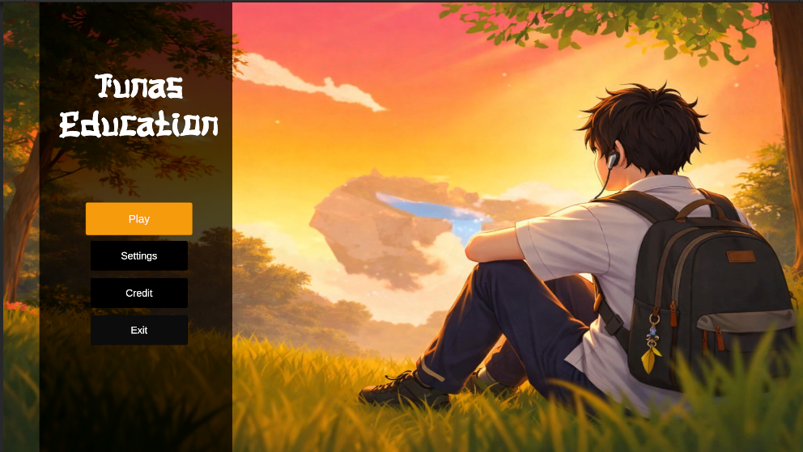
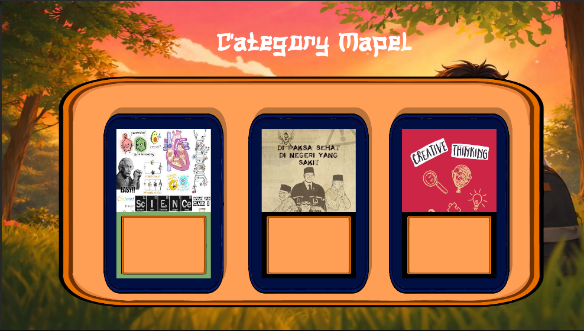
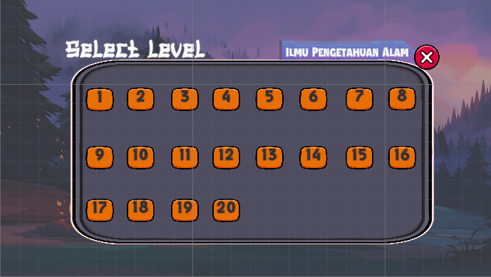
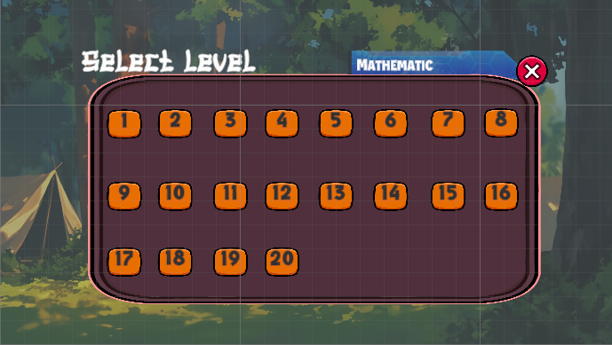
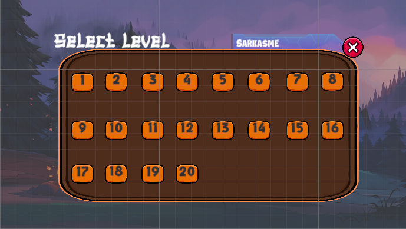
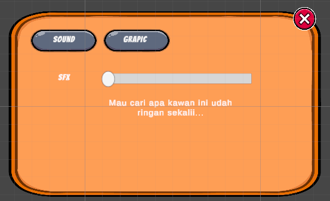

# 🎓 Tunas Education: Premium Quiz Game


**Tunas Education** adalah platform kuis interaktif berbasis Unity yang menggabungkan desain modern "Glassmorphism" dengan pengalaman belajar yang gamified. Project ini dirancang untuk performa tinggi dan kemudahan kustomisasi konten edukasi.

---

## 📑 Daftar Isi
1. [Pratinjau Project](#-tampilan-preview)
2. [Fitur Utama](#-fitur-unggulan)
3. [Spesifikasi Teknis](#-tech-stack--dependencies)
4. [Panduan Instalasi](#-panduan-instalasi)
5. [Dokumentasi Script C#](#-dokumentasi-script-c)
6. [Struktur Folder](#-struktur-project)
7. [Troubleshooting](#-troubleshooting)

---

## 📸 Tampilan Preview
<p align="center">
  
  
</p>
<p align="center">
  
  
  
   
</p>

---

## ✨ Fitur Unggulan
*   **🎯 Intelligent Navigation**: Transisi antar panel menggunakan sistem `CanvasGroup` fading yang hemat resource (bukan sekadar On/Off).
*   **📚 Dynamic Categories**: Sistem pemilihan kategori kuis (Matematika, IPA, dll) yang mudah dikembangkan.
*   **💎 High Fidelity UI**: Menggunakan **TextMeshPro** untuk teks tajam di resolusi apa pun.
*   **⚙️ Cross-Platform Exit**: Logika tombol Quit yang bekerja sempurna di Build maupun Editor.

---

## 🛠️ Tech Stack & Dependencies
*   **Engine**: Unity 2021.3 LTS
*   **Scripting**: C# (.NET Standard 2.1)
*   **Rendering**: Universal Render Pipeline (URP) / Built-in
*   **Version Control**: Git + Git LFS (Large File Storage)

---

## 📥 Panduan Instalasi

### 1. Persiapan Git LFS
Project ini mengandung aset binary besar. Pastikan Git LFS sudah aktif:
```bash
git lfs install
```

### 2. Clone & Pull
```bash
git clone https://github.com/username/tunas-education.git
cd tunas-education
git lfs pull
```

### 3. Membuka di Unity
*   Buka Unity Hub.
*   Pilih folder project: `/home/kiki/project unity/My project/My project/`.
*   Buka Scene `Menu` di folder `Assets/Scenes/`.

---

## 💻 Dokumentasi Script C#

### `MainMenu.cs`
Script utama untuk mengontrol alur menu.
*   **`PlayGame()`**: Memuat scene game berdasarkan variabel `sceneToLoad`.
*   **`QuitGame()`**: Menghentikan aplikasi (mendukung `Application.Quit` dan `EditorApplication.isPlaying`).

**Cara Setup di Inspector:**
1. Assign **Button Play** ke slot `Play Button`.
2. Assign **Button Exit** ke slot `Exit Button`.
3. Isi **Scene To Load** dengan nama scene tujuan (contoh: `GameScene`).

---

## 📂 Struktur Project
```text
Assets/
 ├── Art/               # Sprite, Background, & Icons
 ├── Audio/             # Music & SFX
 ├── Prefabs/           # Objek yang bisa di-reuse
 ├── Scenes/            # Daftar Scene (Menu, Gameplay, Result)
 ├── Scripts/           # Seluruh kode C#
 └── Resources/         # Data Soal (JSON/SO)
```

---

## 🆘 Troubleshooting
*   **Tombol Play Tidak Pindah Scene?**
    Pastikan nama scene di Inspector sudah dimasukkan ke dalam **Build Settings (Ctrl+Shift+B)**.
*   **Gambar di README Tidak Muncul?**
    Pastikan folder `screenshot/` ada di root project dan nama filenya benar (perhatikan spasi).
*   **Error Memory / Koneksi Git?**
    Naikkan buffer git: `git config --global http.postBuffer 524288000`.

---

## 📜 Lisensi
Dilisensikan di bawah **MIT License**.

---
## 👥 Kontributor
Project ini dikembangkan dengan bangga oleh:
*   👤 **kiki** - *Developer*
*   👤 **mbin** - *Developer*
*   👤 **tyas** - *Developer*
*   👤 **dewi** - *Developer*
*   👤 **arin** - *Developer*

---
[Kembali ke atas](#-tunas-education-premium-quiz-game)
